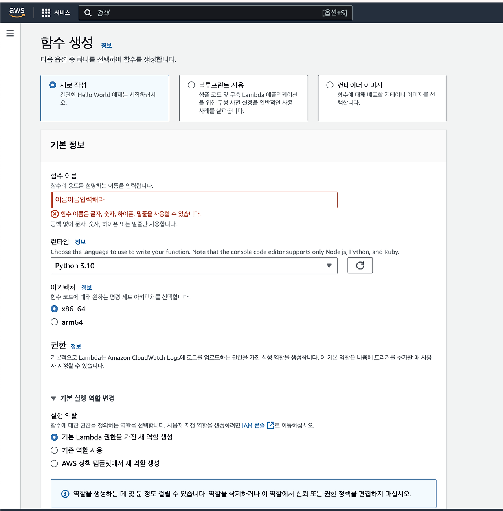
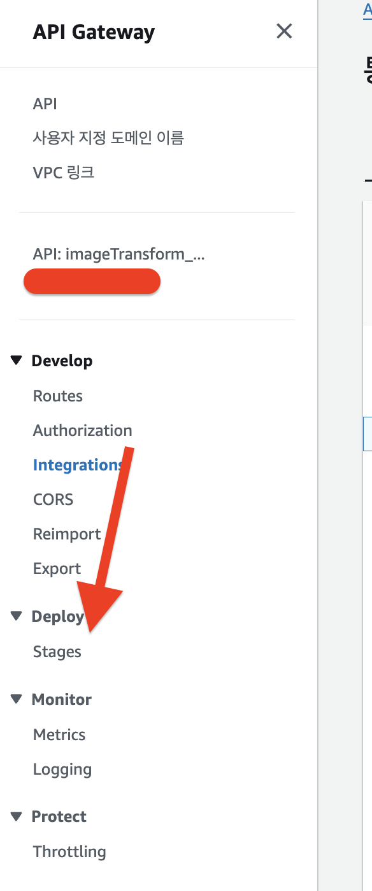

# AWS Lambda와 API Gateway로 서버리스 환경 구성하기

이미지 url을 입력받아 여기서 openCV 라이브러리를 이용해 이미지 처리(perspective transform)한 이미지를 반환해야 했습니다.


현재 프로젝트 BE환경은 Kotlin 100%로 구성되어 있기 때문에 이미지처리를 하기 위해선

1. Kotlin 버전 openCV를 설치하고 이용한다.

2. 외부 환경에서 새로운 서버를 구축하고 이 서버와 통신한다.


둘 중 하나를 선택해야 했습니다.


저의 선택은 2번이었습니다.

그 이유는 개인적으로 파이썬 환경에서 openCV를 이용하는게 편리했고 가용성이 좋다고 생각했습니다. 또 openCV 환경을 코틀린에서 구축하자니 번거롭고 프로젝트 파일 용량이 쓸데없이 무거워지는 작업이라 판단하여 외부에서 새로운 서버를 구축하고 이와 통신하기로 결정했습니다.


그리고나니 또 외부 서버를 어떻게 구축하고 통신할지에 대한 고민이 생겼습니다.

제가 생각한 선택지는 다음과 같습니다.

1. EC2를 새로 파고 거기에 파이썬 서버만 띄워둔다.

2. Lamda를 통해 서버리스 환경을 구축하고 API 통신을 한다.


오로지 가벼운 perspective transform을 위해 새로 EC2를 파고 여기에 서버를 띄우는건 비용 측면에서도 리소스측면에서도 불리하다고 생각하여 Lambda를 이용해 서버끼리 통신을 하기로 하였습니다. 무엇보다 Lambda 월 100만번 호출까지는 무료라는 저렴한 비용이 맘에 들었습니다.

(며칠 전 담당 멘토님의 서버리스 환경 구축하기 특강을 들어 더 마음이 갔을지도...)


그러면 Lambda 함수를 정의하고 API gateway를 통해 서버리스 환경을 구축한 과정을 소개하겠습니다~~~


## 1. Lambda 함수 정의하기


AWS 콘솔에 접속하여 Lambda로 들어갑니다.

함수탭에서 노란버튼인 ` 함수생성 `을 클릭합니다.




함수 이름은 맘대로 입력하고 런타임 언어는 ` Python 3.10 `으로 선택했습니다.

아키텍처는 ` x86_64 `로 선택했고, 실행 역할에서 ` 기본 Lambda 권한을 가진 새 역할 생성 `을 선택하고 함수를 생성했습니다.

사실 맘대로 선택하면 되는데, 제가 다음과 같이 선택한 이유는

일단 openCV 환경을 파이썬으로 돌리기로 생각했기 때문에~? 파이썬을 선택했고

아키텍처는 둘 다 상관없는데.. 이따 또 얘기하겠지만 람다함수에 파이썬 내부의 라이브러리를 붙이는 과정에서 저는 가상머신을 통해 라이브러리 파일을 다운받았기 때문에! 가상머신과 똑같은 아키텍처를 선택했습니다.(먼소린지 모르겠으면 그냥 넘어가면 됩니다)


저는 func_imageTransform이라는 이름으로 함수를 생성했고, 완료되었습니다.


함수 내부를 들어가보면 다음과 같이 나오는데

저는 이미 모든 개발을 완료했기 때문에 람다에 Layers도 2개가 붙어있고 API 게이트웨이도 붙어있지만,

다이어그램에 아마 처음에는 저 주황색 버튼이랑 람다함수 이름만 뜰겁니다.


아래 코드소스에 코드를 입력하면 함수 생성은 다 끝납니다.


근데 여기서 문제,

코드 소스를 붙이는 곳에서는 ``` pip install 어쩌구 ```를 할 수 없는데 외부 라이브러리를 어케 import하나요?


저도 이거 때문에 하루종일 애를 먹었었는데요

바로 떠먹여드리겠습니다.


외부 라이브러리를 임포트하려면 따로 다운 받아서 Layer에 연결을 해줘야 합니다.


바로 따라오셉쇼


먼저 저는 ` 가상머신 `을 사용했습니다.

그 이유는 제 로컬환경인 MAC에서 pip install 어쩌구를 해서 다운받으면 mac용 라이브러리가 다운로드 됩니다.

Lambda는 ` Amazon Linux기반 `이기 때문에 다운한 라이브러리가 실행이 안 될 수 있습니다.

특히 numpy, openCV 요놈들 때문에 애를 많이 먹었습니다.


따라서 저는 Linux 가상머신에 Python 3.10을 다운받았습니다. 그리고 터미널에서 다음 순서대로..

1. 어딘가 편한 곳에 python이라는 폴더를 생성합니다.

2. 해당 폴더 내부로 이동합니다.

3. ``` pip install 어쩌구 -t python ``` 이 명령어로 python 폴더 안에 필요한 라이브러리를 싹 다운받아줍니다.

4. python폴더를 압축합니다.

*압축한 폴더 이름은 뭐가 되든 상관없으나, 압축을 풀고 해당 폴더 내부로 들어갔을 때 무조건무조건무조건 내부 폴더 이름이 python이어야 합니다. 저는 이걸 몰라서 import하는데 하루를 썼습니다. 그냥 모든 폴더 이름을 python으로 통일하는게 맘 편합니다..*


그 다음엔 아까 AWS Lambda 콘솔로 돌아가서


추가 리소스 안에 ` 계층 `으로 들어갑니다.

` 계층 생성 `을 클릭하고

`이름`은 편한 이름 아무거나 설정해주고 `설명`은 굳이 입력하지 않아도 됩니다.

그리고 `.zip파일 업로드`, `Amazon S3에서 파일업로드` 둘 중에 하나를 선택해야되는데

만약 압축파일 용량이 50MB가 넘으면 S3에 업로드 후 이용해야 하고 아니면 저기서 바로 .zip파일로 업로드 하면 됩니다.

`아키텍처`는 아까 람다함수 생성할 때랑 똑같이 x86_64로 선택하고 `호환 런타임`도 똑같이 python3.10으로 합니다.

`생성` 버튼을 누르면 끝납니다.


그리고 아까 만든 Lambda 함수 내부로 들어가 아래로 쭉 내리면 가장 아래 위 화면이 나타납니다.

여기서 오른쪽에 있는 `Add a layer`를 선택합니다.


그리고 계층소스는 `사용자 지정 계층` 을 선택하고

선택 토글을 누르면 아까 업로드 해놓은 layer들이 뜹니다.

저는 boto-layer와 lambda-layer라는 이름의 layer를 생성해둬서 그게 뜨네용

연결하실 계층 이름을 클릭하고 추가를 누르면 끝납니다.


그러면 lambda 함수 코드소스 내에서 자유롭게 import하여 외부 라이브러리를 사용할 수 있습니다.


이러면 lambda함수 세팅은 끝납니다.


## 2. API gateway 설정
   그러면 이제 api gateway를 설정해 만들어 놓은 lambda함수와 통신해야 합니다.

AWS에서 API gateway 콘솔에 접속하여 오른쪽 ` API생성` 버튼을 클릭합니다.


세가지 유형이 있는데 저는 `HTTP API`를 선택했습니다.

HTTP API 비용은 1만번 호출 당 1$입니다.

만약 제가 multipart-form데이터를 주고 받으면 REST API를 선택했어야 하는데, 저는 그렇지 않았기 때문에 저렴한 HTTP API를 선택했습니다.

이후엔 죄다 `다음다음다음다음`을 눌러 `생성`을 완료해줍니다.


그러면 이렇게 생성한 api 들의 이름이 뜹니다.

기존에 생성해둔 것도 있어서 3개가 뜨네용.

생성한 api이름을 클릭해 내부로 들어갑니다.


`생성` 버튼을 눌러 http 요청을 어떻게 처리할 것인지 정의해줍시다.


저는 `POST /transform` 으로 요청이 들어왔을때를 정의해주겠습니다.

적절히 경로를 설정하고 `생성`을 누릅니다.

아까 ANY를 생성해둬서 같이 뜨는데..

여튼 POST /transform 이 생성되었습니다. POST를 누르면 경로 세부정보가 뜨는데

여기서 `통합 연결` 버튼을 누릅니다.


아까 만든 Lambda함수를 선택하고 오른쪽의 `통합 연결` 버튼을 누릅니다.

그러면 람다함수까지 연결이 완료됩니다.


이후 왼쪽 메뉴들 중 `Develop > CORS`를 선택합니다.


그러면 오른쪽 의 `구성` 버튼을 클릭하고


Access 어쩌구가 붙어 있는 세가지에 `*` 와일드카드를 입력해 `저장`합니다.


콘솔 왼쪽의 `Stages`를 눌러 api 엔드포인트를 확인합니다.

그러면 이제 `엔드포인트/transform`으로 접속하면 요청을 할 수 있습니다.


와 서버리스 환경 구성하기 정말 쉽다!